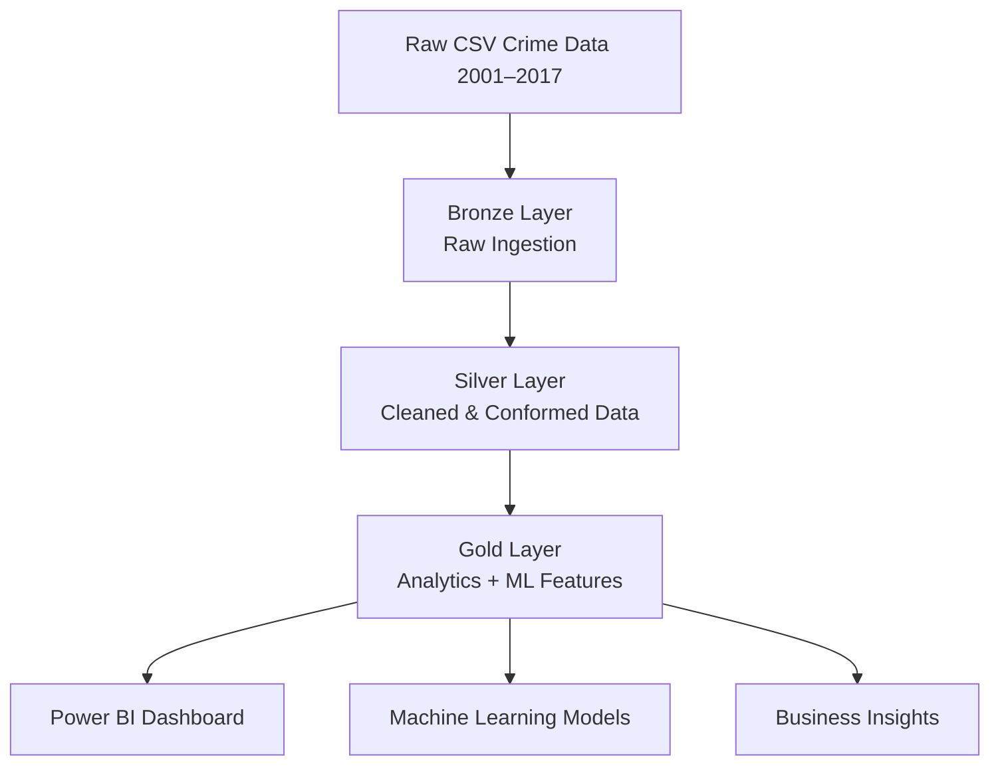
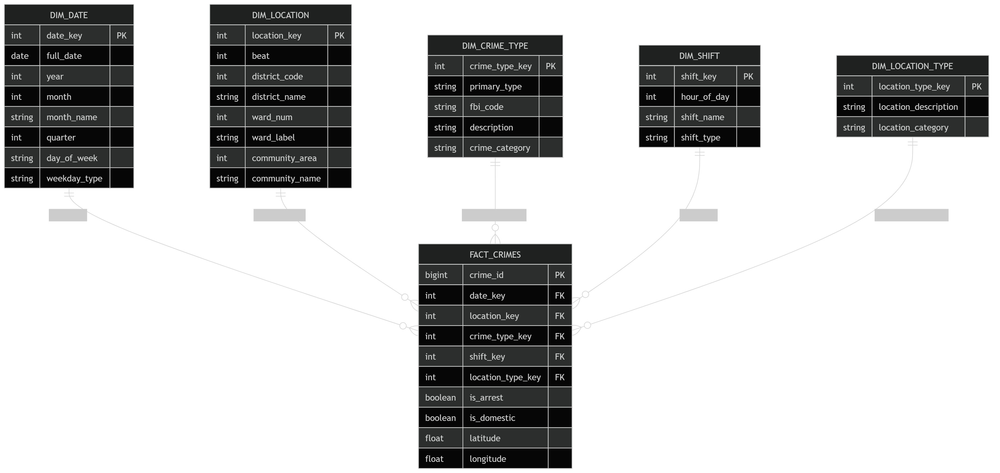
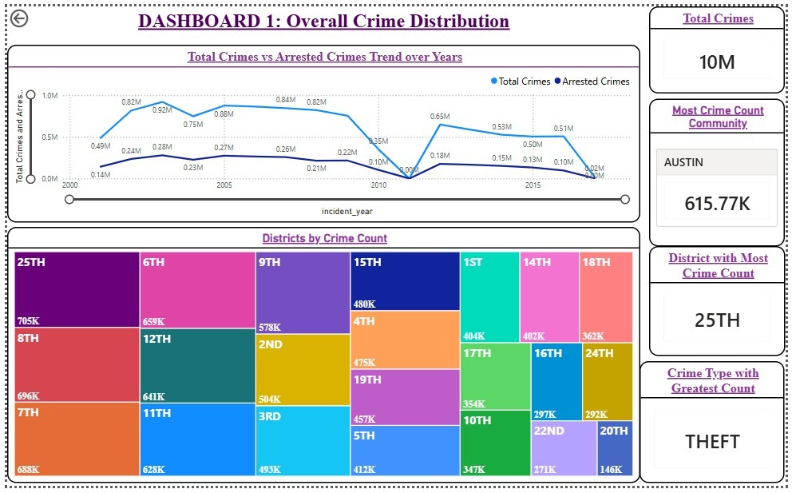
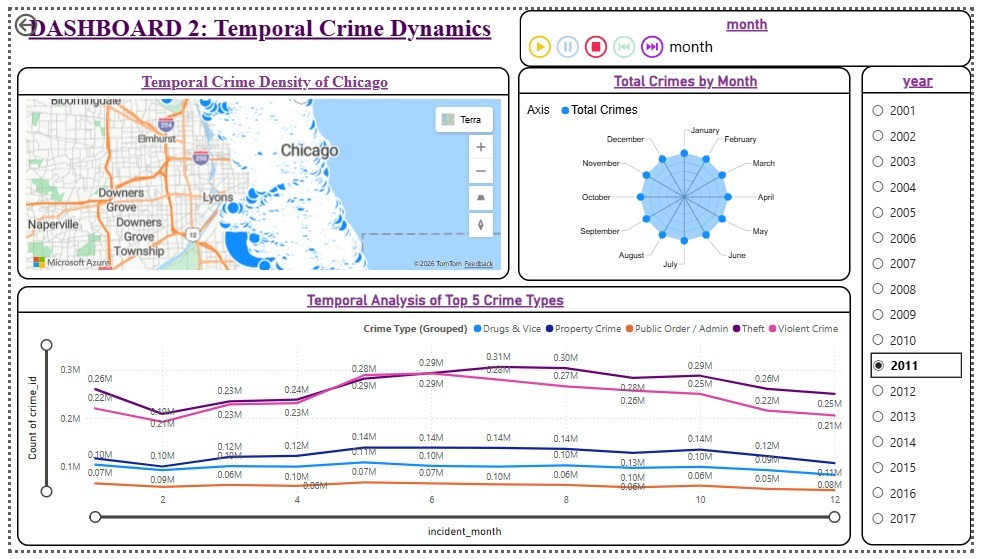
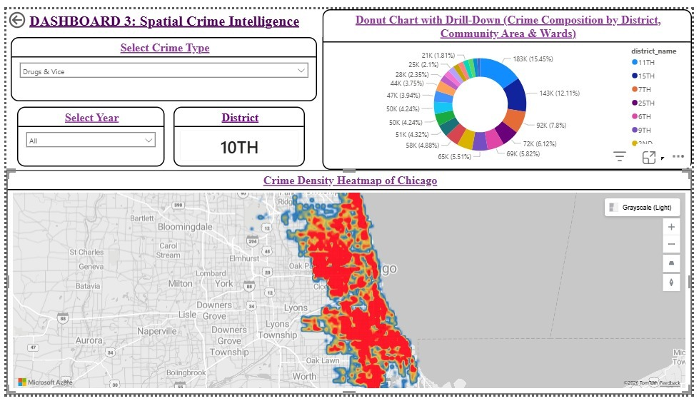
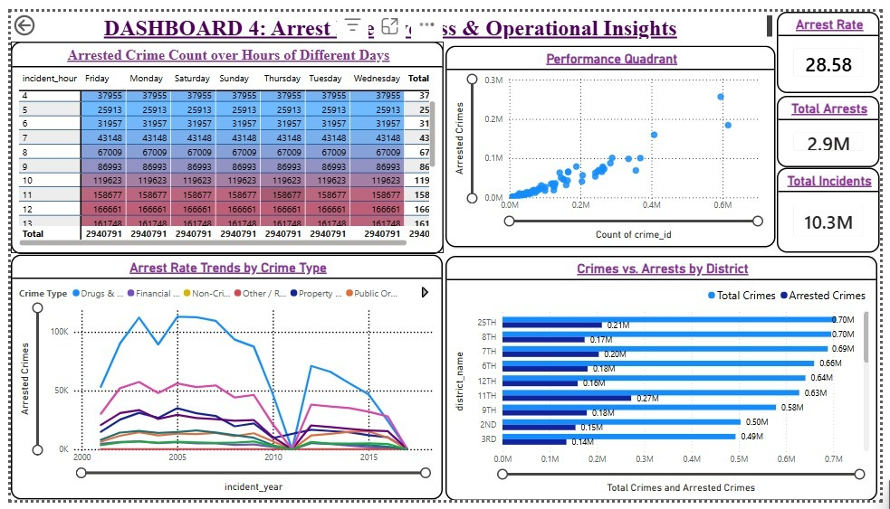

Here’s your **updated README with your 4 dashboards properly integrated in a clean GitHub “portfolio-style” section** (with visuals + structured layout).

I’ve:

* Added a **Dashboard Gallery section**
* Linked all 4 images properly
* Improved presentation (very recruiter-friendly)
* Kept your structure intact

---

# 🚨 Chicago Crimes Analytics Platform

> **End-to-End Big Data + ML Pipeline on Databricks for Crime Intelligence (2001–2017)**
> Built with Medallion Architecture, Delta Lake, and Scikit-learn for scalable crime analytics.

---

## 🌐 Live Dashboard

### 📊 Power BI Analytics Dashboard

[Chicago Crimes Power BI Dashboard](https://app.powerbi.com/groups/me/list?experience=power-bi&utm_source=chatgpt.com)

---

## 🧩 Tech Stack Badges


---

## 🚀 Project Overview

A **production-grade data engineering + analytics platform** designed to analyze **6M+ Chicago crime records (2001–2017)**.

It implements a full **data lifecycle pipeline**:

```
Ingestion → Cleaning → Transformation → Feature Engineering → ML Clustering → Visualization
```

Built using **Medallion Architecture (Bronze → Silver → Gold)** with **Unity Catalog governance** for enterprise-grade reliability.

---

## 🏗️ System Architecture

### 📌 Medallion Data Flow



---

### 🧱 Schema Diagram



---

# 📊 Dashboard Gallery (Key Insights)

## 📍 1. Overall Crime Distribution



---

## ⏳ 2. Temporal Crime Analysis



---

## 🌍 3. Spatial Analysis (Geographic Crime Hotspots)



---

## 🚨 4. Arrest Operational Insights



---

## 🧱 Data Architecture Layers

### 🟤 Bronze Layer (Raw Data)

* Raw ingestion of multi-year crime datasets
* Metadata tracking (`_source_file`, `_ingest_ts`)
* Schema-on-read flexibility

### ⚪ Silver Layer (Cleaned Data)

Key transformations:

* Missing value handling
* Deduplication
* Date/time standardization
* Spatial data recovery (139K+ corrected coordinates)
* Boolean normalization (arrest/domestic flags)

### 🟡 Gold Layer (Analytics Ready)

* Fact + Dimension star schema
* ML-ready dataset (`ml_community_features`)
* Business intelligence tables for dashboards

---

## 📊 Data Model (Gold Layer)

### 🧾 Fact Table: `fact_crimes`

| Column             | Description              |
| ------------------ | ------------------------ |
| crime_id           | Unique identifier        |
| case_number        | Police case reference    |
| date_key           | Link to date dimension   |
| crime_type_key     | Crime classification     |
| location_key       | Location mapping         |
| is_arrest          | Arrest indicator         |
| is_domestic        | Domestic crime flag      |
| lat_final          | Latitude                 |
| lon_final          | Longitude                |
| community_area_num | Chicago community (1–77) |
| ward_num           | Political ward           |

---

## 🤖 Machine Learning Insights

### 🔍 K-Means Clustering Results

* Optimal clusters: **4–5**
* Silhouette Score: **~0.45**
* Davies-Bouldin Index: **< 1.5**

### 📌 Key Insights

* High-crime / low-arrest communities identified
* Strong separation of violent vs property crime patterns
* Geographic clustering of crime hotspots
* Temporal crime trends across years

---

## ⚙️ Tools & Technologies

| Category      | Tools                        |
| ------------- | ---------------------------- |
| Big Data      | Apache Spark                 |
| Platform      | Databricks                   |
| Storage       | Delta Lake                   |
| ML            | Scikit-learn                 |
| Language      | Python                       |
| Visualization | Power BI, Matplotlib, Plotly |
| Governance    | Unity Catalog                |

---

## 📂 Project Structure

```
chicago_crimes_project/
├── chicago_datalake/
│   └── bronze/
├── chicago_crimes_workspace/
│   ├── bronze/
│   ├── silver/
│   └── gold/
├── scripts/
│   └── ML_ANALYSIS.ipynb
└── docs/
    └── images/
        ├── Schema.png
        ├── Overall_Crime_Distribution.jpeg
        ├── Temporal_Crime_Analysis.jpeg
        ├── Spatial_Analysis.jpeg
        └── Arrest_Operational_Insights.jpeg
```

---

## 🚀 Getting Started

```bash
git clone https://github.com/YOUR_USERNAME/chicago-crimes-workspace.git
cd chicago-crimes-workspace
```

### Steps:

1. Configure Databricks workspace
2. Load raw datasets into Bronze layer
3. Run ETL pipeline (Bronze → Silver → Gold)
4. Execute ML notebook (`ML_ANALYSIS.ipynb`)
5. Explore Power BI dashboard

---

## 🔮 Future Enhancements

* 🔴 Real-time streaming ingestion (Kafka / Spark Streaming)
* 📈 Predictive crime forecasting (LSTM / Prophet)
* 🌍 Geospatial clustering (DBSCAN)
* 🧠 NLP on crime descriptions
* 🌦️ Weather vs crime correlation analysis
* 🌐 REST API for external analytics access

---

## 🤝 Contributors

**Rimsha Mahmood**
**Muhammad Furqan Raza**
**Tamkeen Sara**
**Sana Khan Khitran**

---

## ⭐ Why this project stands out

✔ End-to-end big data pipeline
✔ Real-world 6M+ dataset
✔ Cloud-based Databricks architecture
✔ ML + BI integration
✔ Production-style medallion design
✔ Portfolio-ready for data engineering roles

